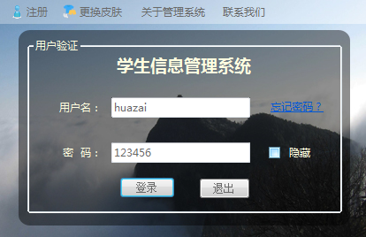
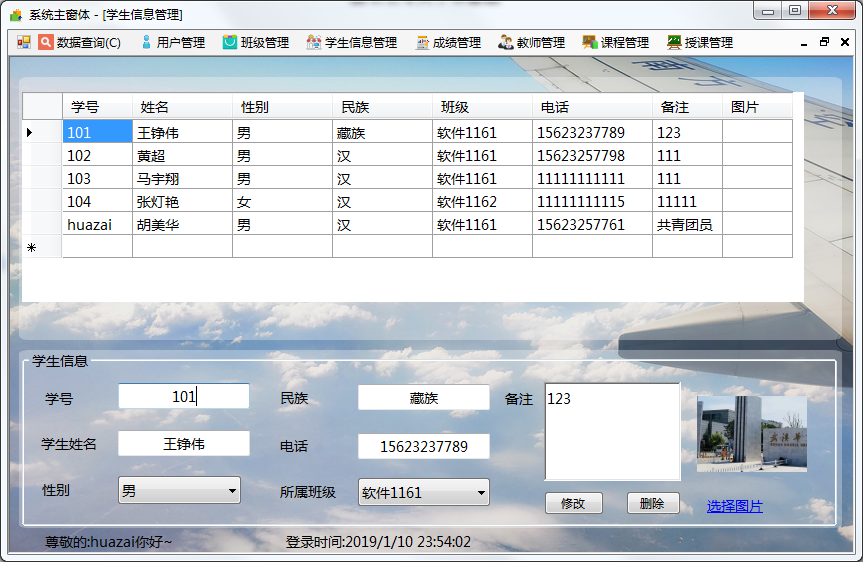

# 校园作业 Java C# JavaWeb ……

### 前言
这里收集了 关于校园课程设计 大作业 毕业设计相关的一些系统 每一个都有运行截图
与演示过 上手简单 非常适合二次开发 😁  主要为Java  C# JavaWeb  后续会陆续增加

##目录
1.  [【学生信息管理系统】 Javaweb + mysql + tomcat](./student/README.md)   
    - 运行截图  
       
2.  [【Java极简计算器】 Java swing ](./calculator/README.md)    
    - 运行截图  
       
     
3.  [【校园教务管理系统】 C# +  Oracle ](./student-management/README.md)    
    - 运行截图  
     
     
     

##提交反馈

- 请注明来意

