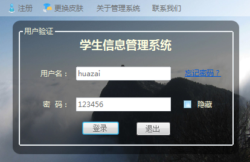
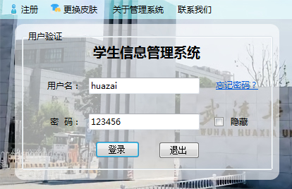
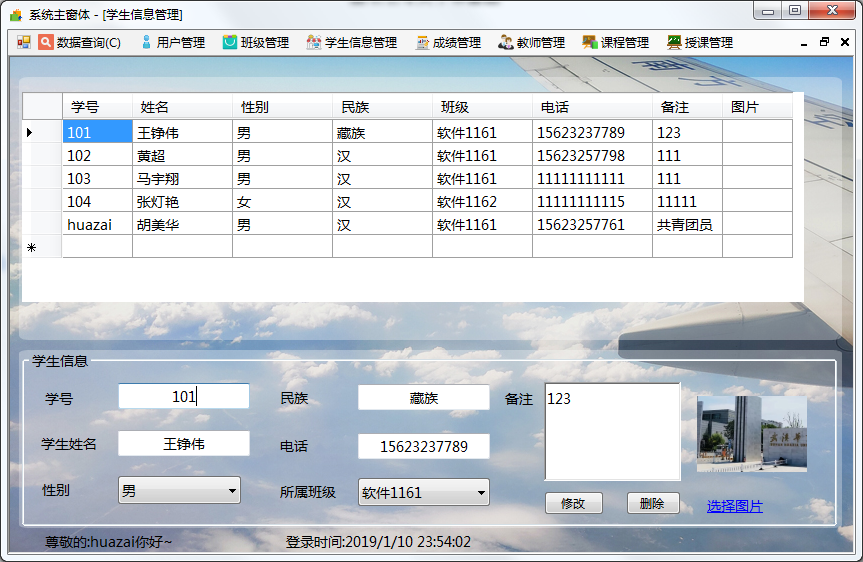
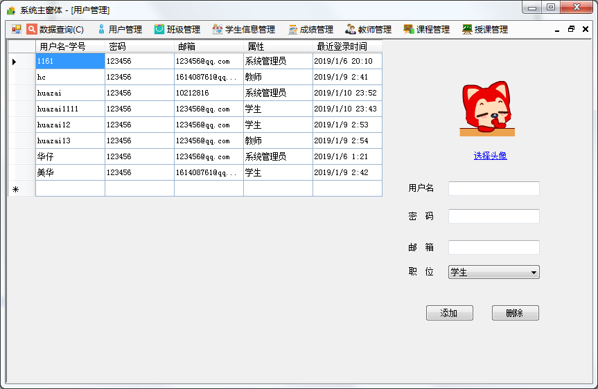
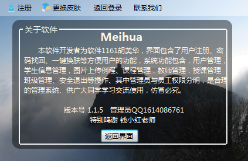

# C# 学生信息管理系统 

### 前言
这是一份使用C# + oracle 实现的 桌面窗体程序管理系统  😁 主要功能如下：

- 一键换肤:根据用户所选自动更换提前设计好的界面。
- 用户注册:方便广大学生自行注册完善自己的信息并且设有权限，访问不了他人的隐私信息。
- 找回密码:根据注册时设置的邮箱来进行密码找回，当验证通过后，即可重设密码。
- 一键查询:登陆后通过判断用户的身份以及用户查询所选来自动查询处可被查询的信息。
- 用户管理:管理员对所有用户的信息进行增删改查，教师与学生没有权限访问。
- 班级管理:管理员与教师对班级的信息进行增删改查。
- 学生信息管理:管理员与教师和学生设置学生的详细信息，其中学生只能设置自己的信息。
- 教师信息管理:管理员对于教师信息的增加、删除、修改和查询。
- 课程管理:管理员与教师对课程的信息进行增删改查。
- 授课管理:管理员与教师对授课的信息进行增删改查。
- 成绩信息管理:管理员与教师对学生的成绩进行添加与管理。
- 关于软件:用户点击是可以查看软件的相关信息与功能。

###项目运行截图
**部分内容为随意编写 请勿当真** **个人信息来不及处理 请不要恶意泄露**   
- 登录页面  

  
- 信息查询

- 管理

- 关于

### 使用说明
1. 安装oracle 数据库 将[Test.mdf](./Test.mdf)与 [Test_log.ldf](./Test_log.ldf) 恢复到自己的数据库中
2. 安装C#开发环境 vs2013 或其他版本 配置数据源即可改动 （需要有一定C#基础）
3. 代码编写之初考虑不够全面 不喜勿喷 如果你有建议 可以与作者联系