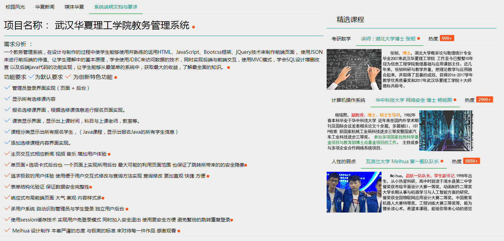
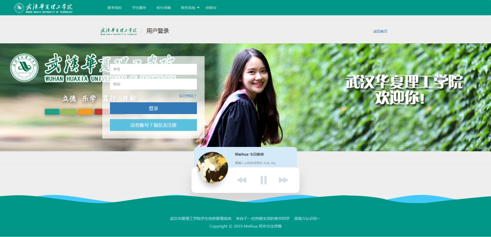
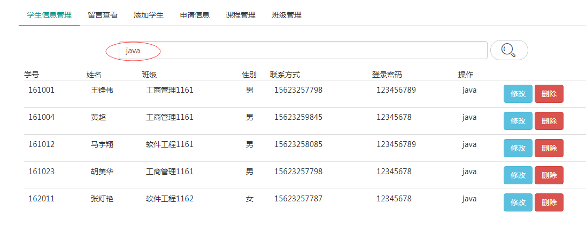
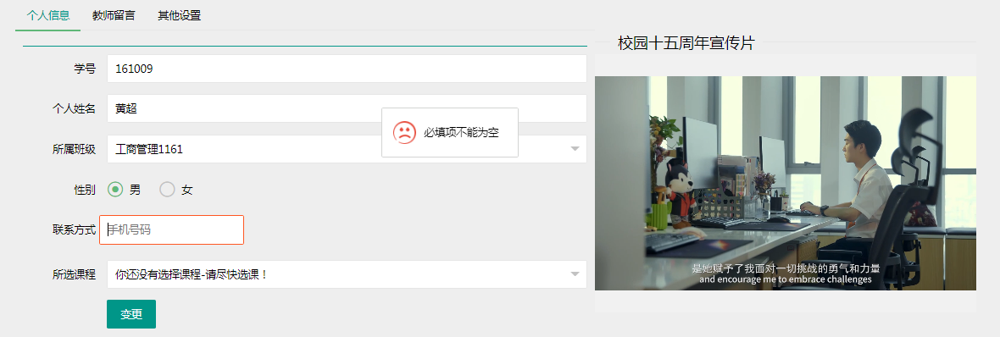

# 学生信息管理系统  

### 前言
这是一份校园JavaWeb 大作业系统 上手简单 但由于年代久远代码较烂 技术较为陈旧 多多包涵！  😁

    硬件环境
    处理器：Inter(R) Core(TM) i7-7700U CPU @ 2.60GHZ  3.30GHZ
    安装内存：8.00GB
    系统类型：64位操作系统
    
    软件环境
    1、Tomcat：apache-tomcat-7.0.94
    2、JDK：jdk1.8.0_171
    3、eclipse：64位
    4、MySql：mysql-5.5.27-winx64
    
    使用技术  JavaWeb mysql tomcat jdbc c3p0 

###项目运行截图
部分内容为随意编写 请勿当真

首页

登录页

后台列表管理




### 使用说明
1. 在mysql中执行 [system.sql](./src/main/resources/system.sql) 
2. 修改 [JdbcUtilsl](./src/main/java/com/meihua/student/utils/JdbcUtils.java) 中的mysql 地址为自己的
````
	static {
  		dataSource.setUser("root");
  		dataSource.setPassword("123456");
  		dataSource.setJdbcUrl("jdbc:mysql://127.0.0.1:3306/system");
  		try {
  			dataSource.setDriverClass("com.mysql.jdbc.Driver");
  		} catch (PropertyVetoException e) {
  			e.printStackTrace();
  		}
  	}
````
3. tomcat 设置服务上下文 为 School
4. 代码编写之初考虑不够全面 不喜勿喷 如果你有建议 可以与作者联系

启动！